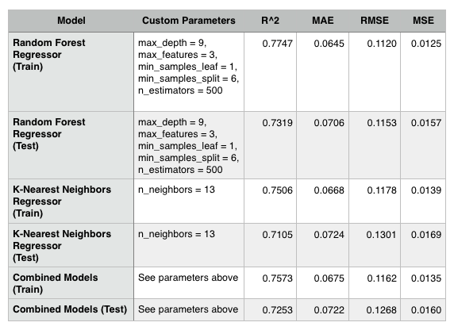

# 44688-Data-Analytics-Capstone
Capstone for the degree of MS in Data Analytics from NWMSU.

## Research Goals
The goal of this research is to develop a machine learning model that accurately predicts the line-item value for antiretroviral drugs and HIV lab supplies that are to be shipped to countries negatively affected by the HIV/AIDS endemic. The goal is to make these predictions using a regression algorithm based off of known characteristics of the desired drug or lab test that could be found on a purchase order sent to a vendor or manufacturer. If a successful model is created, this could help nations and organizations better plan for future purchases of antiretroviral drugs and HIV supplies without having to wait for price quotes from manufacturers.

## Data Source
https://data.usaid.gov/HIV-AIDS/Supply-Chain-Shipment-Pricing-Data/a3rc-nmf6

## Overleaf Link
https://www.overleaf.com/read/xjqzqzscypfy

## Setup
To run this project you need an environment with the following applications installed:
- Python 3: https://www.python.org/downloads/
- numpy: https://pypi.org/project/numpy/
- pandas: https://pypi.org/project/pandas/
- sodapy: https://pypi.org/project/sodapy/
- matplotlib: https://pypi.org/project/matplotlib/
- seaborn: https://pypi.org/project/seaborn/
- scikit-learn: https://pypi.org/project/scikit-learn/

## Results

The results of the fine-tuned Random Forest Regressor, fine-tuned K-Nearest Neighbor Regressor, and the Combined Model are listed in the table below. The fine-tuned Random Forest Regressor performed best according to all metrics, while the Combined Model performed second best. Because performance is similar on all models between the training and test sets, there is little evidence of over-fitting and the models should generalize to new data well. All of the fine-tuned models had mean absolute errors for test and train sets between about 6.45% and 7.24%. When converted to US$, these mean absolute errors are between about $13,999.57 and $15,670.84. 

## Future Work

Further work is needed to produce a model that would be capable of enhancing business knowledge pertaining to purchasing large orders of antiretroviral drugs and HIV lab tests in order to help countries better prepare for combating the HIV/AIDS endemic. One possible route forward includes dividing the data set into two groups: medications vs. testing supplies and developing two independent machine learning models to make more exact predictions. These two models could be combined in order to produce a more reliable model with less error. Another route forward would be to bring in more features to the model. The models produced during the span of this project included only a small number of the features available in the cleaned data set. Only 12 features of the original 77 features were included in the models. While adding more features would require more information provided by a business user in order to produce predictions, this may allow for models with reduced error. Inspecting the data points with large amounts of error, may help determine which features that may be beneficial to add back into the model.
